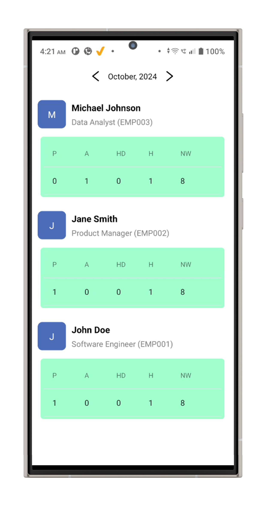

# Employee Management System

A mobile application built using React Native for managing employee details, tracking attendance, and generating attendance reports. This application uses a Node.js backend with MongoDB for data storage.

## Features

- **Add Employee**: Easily add new employee details, including name, designation, and contact information.
- **Take Attendance**: Mark attendance for employees with a simple interface.
- **Attendance Reports**: View and generate reports of employee attendance for specified periods.

## Technologies Used

### Frontend

- **React Native**: A framework for building native apps using React.
- **Expo**: A platform for making universal native apps for Android, iOS, and the web.
- **Axios**: A promise-based HTTP client for making API requests.
- **React Navigation**: For navigating between different screens in the app.

### Backend

- **Node.js**: A JavaScript runtime for building server-side applications.
- **Express.js**: A web application framework for Node.js to build APIs.
- **MongoDB**: A NoSQL database for storing employee and attendance data.
- **Mongoose**: An ODM (Object Data Modeling) library for MongoDB and Node.js.

